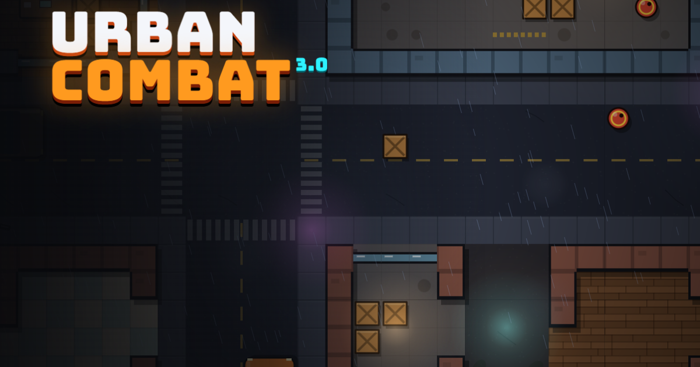

# Urban Combat

A fast top-down arcade shooter that runs in the browser. Fight through an endless city, evolve your weapons, build a loadout and climb the career ranks.

**Play:** https://donny1dev.github.io/UrbanCombat2D/

Free to play, with no purchases, ads or accounts. Everything is earned by playing.



## Features

- **Arcade combat:**
  - 6 weapons, 71 upgrades and 14 upgrade synergies
  - 16 weapon evolutions (10 tier I, 6 tier II), tracked separately per weapon
  - 7 build archetypes, card locks and rerolls
- **Equipment loadouts:** three slots (Armour, Tactical Gadget on `Q`, Support on `E`) with 8 items each and 8 equipment synergies.
  - Items have 3 ranks and 4 rarities (Common, Rare, Epic, Legendary), and every rarity adds a real perk.
  - Equipment crates appear after wave 3 and then every 3–4 waves. Bosses, elite hunts, occasional elite kills and supply drops also drop them.
- **Enemies:** five enemy types, Elites and the Engineer's sentry turrets, plus 3 bosses (Juggernaut, Commander, Engineer). Every boss attack is telegraphed and each boss has a weakness window.
- **Modes:**
  - **Standard:** endless survival.
  - **Hardcore:** +50% enemy damage, +15% enemy HP, half healing, no world medkits; rewards ×1.5.
  - **Daily Operation:** a date-seeded city, weapon and modifiers; rewards ×1.25.
  - **Training Grounds:** dummies, a DPS meter, and live weapon and gear switching; no rewards.
- **Progression:**
  - 8 career ranks, from Rookie to Urban Legend
  - Supply Credits to unlock equipment and weapons
  - 32 achievements and 5 unlockable profile frames
  - cosmetic options that unlock with career level
- **In-run objectives** and an **OPERATION COMPLETE** summary with REDEPLOY, CHANGE LOADOUT and MAIN MENU.
- **Local profiles:** several callsigns per device, or play as a guest at any time.
- **Settings and accessibility:**
  - quality presets (Auto, Low, Medium, High), resolution scale and particle density
  - separate volume buses
  - full key rebinding
  - colour-blind palettes (deuteranopia, protanopia, tritanopia)
  - reduced motion, reduced flashing, HUD scale, crosshair styles and colour
  - edge indicators, pause on focus loss
  - a skippable first-run tutorial

## Controls (defaults, all rebindable)

| Action | Key |
|---|---|
| Move | `W` `A` `S` `D` |
| Aim / fire | Mouse / hold left click |
| Dash | `Shift` (or `Space`) |
| Reload | `R` |
| Tactical gadget | `Q` |
| Support equipment | `E` |
| Build overview | `Tab` |
| Pause | `Esc` (or `P`) |
| Level-up / crate choice | `1` `2` `3` or click; `R` rerolls, `L` locks a card |
| Mute | `M` |
| Performance overlay | `F3` |

The game needs a keyboard and mouse. Touch and gamepad are not supported (see [Known limitations](#known-limitations)).

## Records and leaderboards

There is no online service. The **LOCAL RECORDS** screen ranks runs from the profiles on this device only, and says so on screen.

Usernames (callsigns) are unique only among the profiles on one device. They are not reserved globally.

Online leaderboards would need a backend. [Adding an online backend](#adding-an-online-backend) explains what that would involve. Nothing in this build pretends to offer one.

## Privacy

- **Local storage only:** profiles, progress and settings stay in your browser's localStorage under the key `uc3_save`. A short session flag skips the intro after the first view.
- **Nothing collected:** no analytics, accounts, cookies, trackers or ads. The game never sends your data anywhere.
- **Two network requests:** the page loads its fonts from Google Fonts. In production builds it also fetches `version.json` from this site, to tell you when a newer version has been deployed.
- **Your data, your control:** **Settings → Data** lets you export your save (download or copy), import a backup, or delete everything.

## Run it locally

You need Node.js 20.19+ or 22.12+ (required by Vite 8).

```bash
npm install
npm run dev            # http://localhost:5173 with hot reload
npm run build          # production build in dist/
npm run preview        # serve dist/ at http://localhost:4173
```

Debug helpers: `?debug` skips the intro, creates a guest if needed and exposes `window.__UC`. `?bench` also loads the stress-test API. `F3` toggles the performance overlay.

## Tests

```bash
npm run lint           # ESLint (no-undef, no-shadow and other errors fail the build)
npm test               # Vitest unit tests (stats, equipment rules, saves, migration, rewards, profiles)
npm run test:e2e       # Playwright end-to-end tests against a fresh production build
npm run bench -- "http://localhost:4173/?bench" --throttle=4
npm run soak  -- "http://localhost:4173/?debug" --minutes=45 --cycles=50
```

- **Browsers:** the e2e suite uses Playwright's bundled Chromium (`npx playwright install chromium`). To use an installed browser instead, run `PW_CHANNEL=msedge npm run test:e2e`.
- **Coverage:** the e2e suite covers:
  - the first-launch flow and guest mode
  - every menu screen
  - movement and firing
  - gadgets, crates and level-ups
  - all three bosses
  - death → results → redeploy
  - Training mode
  - v2 save migration and corrupt-save recovery
  - persistence of the character look, purchases and key bindings
  - export and import
  - layouts at 1280×720, 1366×768 and 1920×1080

Measured performance and long-run stability results are in [docs/PERFORMANCE.md](docs/PERFORMANCE.md).

## Deploying (GitHub Pages)

`.github/workflows/deploy.yml` runs lint, unit tests, e2e tests and the build on every push and pull request, and deploys `dist/` from `main`.

One-time setup: **repository Settings → Pages → Build and deployment → Source: GitHub Actions**.

How updates reach players:

- **Cache-safe assets:** Vite fingerprints JS and CSS file names, so a new deploy never mixes old and new code.
- **Short HTML cache:** `index.html` and `version.json` are cached briefly by GitHub Pages (about 10 minutes).
- **Update notice:** a running game checks `version.json` on load and shows a toast if a newer build is live.

`vite.config.js` uses `base: './'`, so the same build works at `/UrbanCombat2D/` or any other path.

## Project structure

```
src/
  core/       util, registry, storage, settings, canvas, input, audio, fixed-step loop
  data/       pure game data: weapons, upgrades, evolutions, equipment, enemies, modes, progression, achievements
  systems/    pure or testable rules: stats, offers, equipment rules, profiles, persistence, career, grid, director, objectives
  world/      procedural city and arena generation, collision, flow field
  rendering/  map chunk cache, sprites, FX pools, HUD, scenes, text cache
  entities/   player, enemies, bosses, combat, pickups, destruction
  game/       run orchestration (Game), save manager, tutorial, training
  ui/         DOM screens: menu router, deploy, loadout, profile, arsenal, records, settings, level-up, results
  debug/      F3 overlay, stress-test scenarios and soak driver (loaded only with ?debug / ?bench)
tests/
  unit/       Vitest
  e2e/        Playwright
  bench/      stress benchmark, CPU profiler, v2 baseline harness
  stability/  long-run soak and restart cycles
```

Imports flow one way: core → data → systems → world → rendering → entities → game → ui. Cross-layer calls that would create a cycle go through the late-bound registry `G` in `core/registry.js`. The simulation runs at a fixed 60 Hz and rendering interpolates between steps.

## Saves

- **Format:** the save is versioned (schema 3) and validated on load.
- **v2 migration:** v2 saves (`uc_*` keys) are migrated automatically on first launch, and the player is asked for a callsign.
- **Corrupt saves:** a damaged save is kept as `uc3_save_corrupt_<time>`, the player is told, and the game starts with whatever could be recovered.
- **Exports:** exported saves include a checksum that catches accidental damage. The checksum is not tamper-proof. That is acceptable only because everything is local: importing a save cannot affect anyone else.

## Adding an online backend

Not implemented. If you add one, the minimum requirements are:

1. **Real accounts.** Use a hosted auth provider (for example Supabase Auth). Make usernames unique on the server, not in the client.
2. **Write rules on the server.** For example, Supabase Row Level Security so a user can insert only their own runs. Only the public anon key belongs in browser code. **Never ship a service-role or admin key to the browser.**
3. **Server-side run validation.** Recompute or bound scores on the server, using an Edge Function or a database function: run time against kills, waves against time, rate limits. Never accept client totals as-is, and never accept an imported local save as competitive proof.
4. **Separate local and online records.** Keep the local records screen, and label online boards clearly as online.

## Known limitations

- **Input:** keyboard and mouse only. Touch devices get a notice, and there is no gamepad support.
- **No online play:** no online leaderboards, accounts or cloud saves.
- **Daily Operation is honour-based:** it uses the same seed for everyone on the same date, but results are local, so nothing verifies them.
- **Hardware coverage:** performance was measured on one desktop, using CPU throttling to emulate slower machines. Very low-end laptops and mobile browsers were not tested.
- **Fonts:** the game loads Bungee and Barlow Condensed from Google Fonts. When offline it falls back to system fonts.

## Credits

Game design, code and procedural art by Donny1dev and contributors. No licence file is included yet, so all rights are reserved by the author until one is added. All visuals are drawn in code and all sounds are synthesised with the Web Audio API, so there are no third-party art or audio assets.
